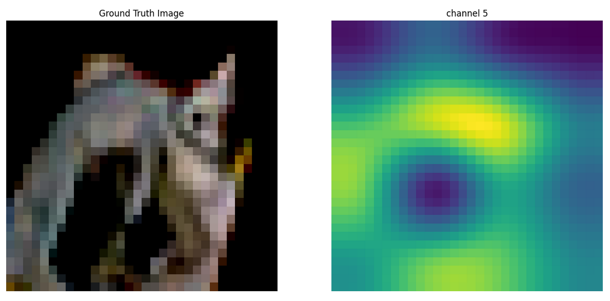

# CAM Tutorial 

- Using last Conv feature maps and fully connected layer weights related to the node predicted by the model

- Specifically, we train CNN model on a CIFAR $10$ ( $3 \times 32 \times 32$ )
  - First, multiply all of feature maps $[64 \times 4 \times 4]$ with FC layer weights $[64 \times 1 \times 1]$: $[64 \times 4 \times 4]$
  - Second, add all of the feature maps $[4 \times 4]$
  
 
- Result

