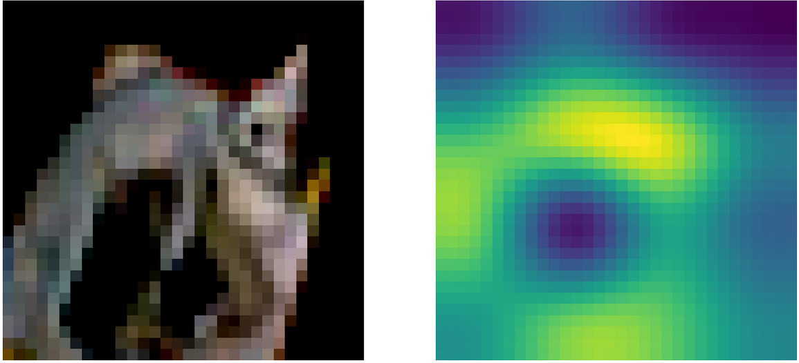
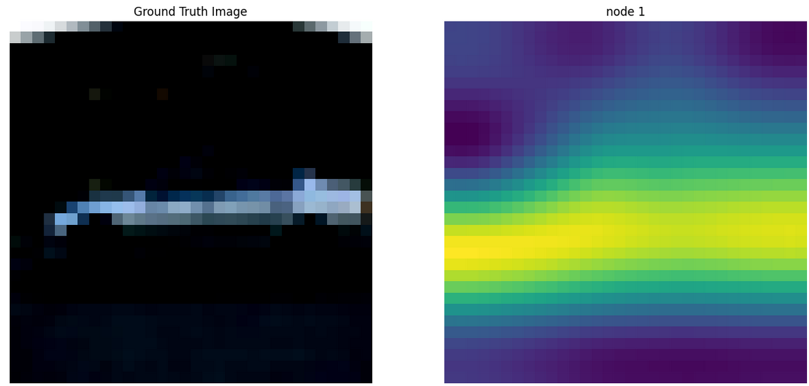
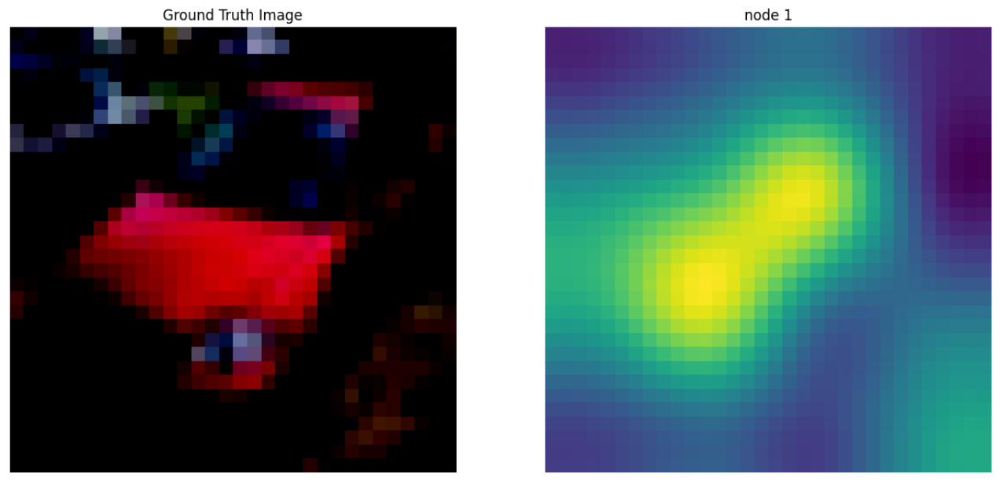

# CAM Tutorial 

- Using last Conv feature maps and fully connected layer weights related to the node predicted by the model

- Specifically, we train CNN model on a CIFAR $10$ ( $3 \times 32 \times 32$ )
  - First, multiply all of feature maps $[64 \times 4 \times 4]$ with FC layer weights $[64 \times 1 \times 1]$: $[64 \times 4 \times 4]$
  - Second, add all of the feature maps for channel: $[4 \times 4]$
  - Finally, resize the attention map with interpolation: $[32 \times 32]$ 
  
 
- Results

# Grad_CAM Tutorial

- Use last Conv feature maps and gradients $\alpha_k^c = \frac{1}{Z} \sum_i \sum_j \frac{\partial y^c}{\partial A_{ij}^c}$ : $\alpha^c \in \mathbb{R}^{64 \times 1 \times 1}$
- Take linear combination and ReLU activation $\text{ReLU} (\sum_k \alpha_k^c A^k)$ : $[4 \times 4]$
- Resize the attention map with interpolation: $[32 \times 32]$ 

